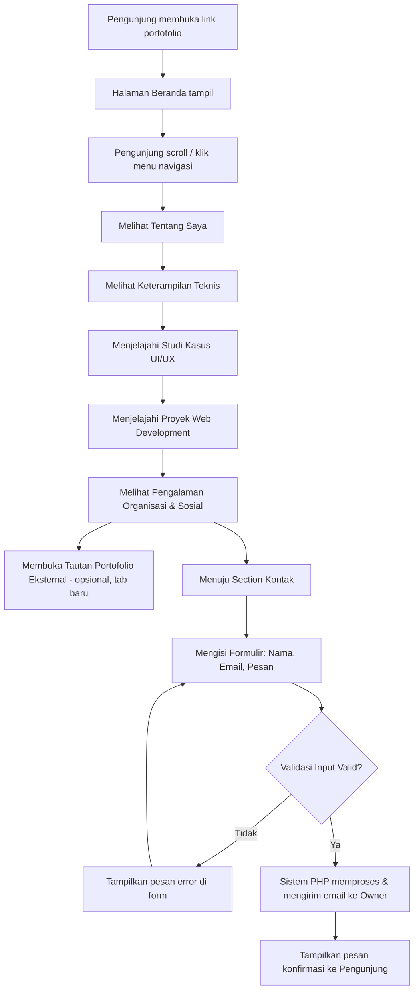

# Product Requirement Document (PRD)
## Portfolio Web

| Atribut | Detail |
|---|---|
| Nama Produk | Portfolio Web |
| Jenis Platform | Responsive Website |
| Tech Stack Utama | HTML, CSS, PHP (vanilla) + Tailwind CSS |
| Versi Dokumen | 1.0 |
| Status | Draft untuk Review Engineering |

---

## 1. Gambaran Umum Produk

### 1.1 Latar Belakang
Di dunia kerja dan akademik saat ini — khususnya bagi mahasiswa atau profesional muda di bidang teknologi, desain, maupun data — portofolio digital menjadi alat presentasi diri yang jauh lebih efektif dibandingkan CV berbentuk dokumen statis. Portofolio berbasis web memungkinkan pemilik menampilkan hasil karya (proyek web development, studi kasus UI/UX, keterampilan teknis) secara interaktif, mudah diakses oleh siapa saja (recruiter, klien, dosen), dan dapat diperbarui kapan saja tanpa perlu mengirim ulang file.

Namun banyak portofolio pribadi yang dibuat terburu-buru cenderung terlihat generik — menggunakan template siap pakai yang membuatnya terkesan seragam dan kurang mencerminkan identitas personal pemiliknya ("terasa seperti hasil template AI"). Selain itu, pengelolaannya sering kali tidak konsisten dari sisi struktur visual maupun kerapian kode, sehingga sulit dikembangkan lebih lanjut.

Oleh karena itu, dibutuhkan sebuah website portofolio yang dibangun dengan struktur yang jelas, desain yang konsisten dan personal (bukan sekadar template generik), serta dikembangkan dengan stack teknologi yang ringan dan mudah dirawat: HTML, CSS, PHP, dan Tailwind CSS.

### 1.2 Pernyataan Masalah
1. **Portofolio yang tidak konsisten secara visual** — Banyak portofolio pribadi memiliki gaya desain yang berbeda-beda di tiap halaman (warna, tipografi, spacing tidak seragam), sehingga terlihat kurang profesional.
2. **Kurang mencerminkan identitas personal** — Penggunaan template generik membuat portofolio terasa generik/"AI slop" — sulit dibedakan dari ribuan portofolio lain, tidak menonjolkan kekuatan dan karakter pemiliknya.
3. **Struktur konten yang tidak terorganisir** — Tanpa perencanaan matang, informasi penting seperti studi kasus proyek, keterampilan, dan pengalaman organisasi sering tercampur atau tidak mudah ditemukan oleh pengunjung (recruiter/klien).
4. **Tidak responsif di berbagai perangkat** — Banyak portofolio pribadi yang hanya nyaman dilihat di desktop, padahal sebagian besar recruiter/klien pertama kali membuka link portofolio dari smartphone.
5. **Sulit dihubungi** — Tidak adanya formulir kontak yang jelas dan terintegrasi membuat calon klien/recruiter kesulitan untuk menindaklanjuti ketertarikan mereka.

### 1.3 Tujuan Produk
* Menyediakan satu platform terpusat yang menampilkan identitas profesional pemilik secara konsisten dan personal.
* Menampilkan keterampilan teknis, studi kasus UI/UX, dan proyek web development secara terstruktur dan mudah dijelajahi.
* Memberikan pengalaman menjelajah yang nyaman di semua perangkat (mobile-first, responsive).
* Memudahkan pengunjung (recruiter, klien, kolaborator) untuk menghubungi pemilik portofolio melalui formulir kontak yang jelas.
* Dibangun dengan kode yang ringan, rapi, dan mudah dirawat/dikembangkan sendiri tanpa dependensi framework backend yang berat.

### 1.4 Target Pengguna
* **Pemilik Portofolio (Owner)** — Pemilik website sekaligus pihak yang mengelola konten (menambah/mengedit proyek, mengunggah gambar, membaca pesan masuk dari formulir kontak).
* **Pengunjung Umum / Recruiter / Klien** — Pihak eksternal yang mengakses website untuk melihat profil, karya, dan menghubungi pemilik untuk peluang kerja, kolaborasi, atau proyek freelance.

---

## 2. Peran Pengguna (User Roles) & User Stories

### 2.1 Definisi Peran
| Peran | Deskripsi |
|---|---|
| **Pengunjung (Visitor)** | Siapa pun yang mengakses website tanpa perlu login — recruiter, klien, sesama developer/designer, dosen, dsb. |
| **Pemilik (Owner/Admin)** | Pemilik tunggal website yang mengelola konten portofolio (melalui pengeditan langsung pada file/kode pada MVP, dengan opsi panel admin sederhana sebagai pengembangan lanjutan). |

Catatan: Karena ini adalah portofolio pribadi berskala kecil, sistem tidak memerlukan multi-role kompleks seperti pada sistem multi-user.

### 2.2 User Stories

**Sebagai Pengunjung:**
- Sebagai Pengunjung, saya ingin melihat halaman Beranda dengan foto profil/avatar dan ringkasan singkat sehingga saya langsung mendapat kesan pertama tentang siapa pemilik portofolio ini.
- Sebagai Pengunjung, saya ingin membaca halaman Tentang Saya sehingga saya memahami latar belakang, minat, dan nilai profesional pemilik.
- Sebagai Pengunjung, saya ingin melihat daftar Keterampilan Teknis lengkap dengan ikon tools (Laravel, Flutter, Figma, SPSS, dll.) sehingga saya cepat menilai kompetensi pemilik.
- Sebagai Pengunjung, saya ingin menjelajahi Studi Kasus UI/UX Design lengkap dengan wireframe dan mockup sehingga saya memahami proses berpikir desain pemilik, bukan hanya hasil akhirnya.
- Sebagai Pengunjung, saya ingin melihat Proyek Web Development dengan tangkapan layar antarmuka sehingga saya bisa menilai kualitas hasil kerja teknis pemilik.
- Sebagai Pengunjung, saya ingin melihat Pengalaman Organisasi & Sosial beserta dokumentasi foto kegiatan sehingga saya mendapat gambaran soft skill dan kontribusi sosial pemilik.
- Sebagai Pengunjung, saya ingin mengakses Tautan Portofolio Eksternal (GitHub, Figma, LinkedIn) sehingga saya dapat menelusuri lebih lanjut karya atau profil profesional pemilik di platform lain.
- Sebagai Pengunjung, saya ingin mengisi Formulir Kontak sehingga saya dapat menghubungi pemilik terkait peluang kerja atau kolaborasi.
- Sebagai Pengunjung, saya ingin website ini nyaman diakses dari smartphone saya sehingga saya tidak perlu membuka laptop hanya untuk melihat portofolio.

**Sebagai Pemilik (Owner):**
- Sebagai Owner, saya ingin memperbarui konten proyek (menambah studi kasus atau proyek baru) dengan mudah sehingga portofolio saya selalu up-to-date.
- Sebagai Owner, saya ingin menerima notifikasi/email saat ada pesan masuk dari formulir kontak sehingga saya tidak melewatkan peluang yang masuk.
- Sebagai Owner, saya ingin struktur kode yang rapi dan modular sehingga saya dapat menambah section baru di masa depan tanpa merombak keseluruhan halaman.

---

## 3. Ruang Lingkup (Scope of Work)

### 3.1 In-Scope (MVP)
Delapan halaman/section utama sebagai satu halaman scrollable (single-page) dengan navigasi anchor link:

1. **Beranda (Hero Section)** — Foto profil/avatar/ilustrasi AI-generated, nama, tagline profesional singkat, dan call-to-action (misal tombol "Lihat Proyek" / "Hubungi Saya").
2. **Tentang Saya** — Foto diri (profesional/kasual), narasi singkat latar belakang, minat, dan nilai profesional.
3. **Keterampilan Teknis** — Grid/list ikon dan nama tools (Laravel, Flutter, Figma, SPSS, dll.) dikelompokkan per kategori (Development, Design, Data/Analytics).
4. **Studi Kasus UI/UX Design** — Card/list studi kasus, masing-masing menampilkan gambar wireframe/mockup, ringkasan masalah-proses-solusi.
5. **Proyek Web Development** — Card/list proyek dengan tangkapan layar antarmuka, deskripsi singkat teknologi yang dipakai, dan tautan ke demo/repository.
6. **Pengalaman Organisasi & Sosial** — Timeline atau card kegiatan organisasi/sosial dengan foto dokumentasi dan deskripsi peran.
7. **Tautan Portofolio Eksternal** — Ikon/tombol tautan ke GitHub, Figma, LinkedIn (dan platform lain jika relevan).
8. **Kontak & Formulir** — Formulir kontak (nama, email, pesan) yang diproses via PHP (mengirim email), dilengkapi ikon media sosial/kontak pendukung.

Fitur pendukung MVP:
- Navigasi responsif (navbar dengan hamburger menu di mobile).
- Smooth scroll antar section.
- Validasi input formulir kontak (client-side dan server-side).
- Optimasi gambar dasar (lazy loading) agar halaman tetap ringan.
- SEO dasar (meta title, meta description, Open Graph tags untuk keperluan share link).

### 3.2 Out-of-Scope (Fase Ini)
- Panel admin/CMS untuk mengelola konten via dashboard (pada MVP, konten dikelola langsung melalui kode/file).
- Sistem autentikasi/login untuk pengunjung.
- Multi-bahasa (hanya Bahasa Indonesia pada MVP; opsional Inggris di masa depan).
- Blog atau sistem artikel terpisah.
- Integrasi analytics lanjutan (dapat ditambahkan belakangan, bukan prioritas MVP).
- Dark mode/theme switcher (dapat menjadi pengembangan lanjutan).
- Backend framework berat seperti Laravel — sesuai catatan proyek, MVP murni menggunakan PHP native, HTML, CSS, dan Tailwind CSS, tanpa framework backend tambahan.
- Build tool/bundler (Webpack/Vite) — Tailwind digunakan dalam bentuk paling ringan agar sesuai prinsip "tanpa AI slop", cukup HTML, CSS, dan PHP polos.

---

## 4. Kebutuhan Sistem (Functional & Non-Functional)

### 4.1 Kebutuhan Fungsional

**A. Navigasi & Struktur Halaman**
- Navbar sticky dengan anchor link ke setiap section (Beranda, Tentang Saya, Keterampilan, Studi Kasus, Proyek, Organisasi, Tautan, Kontak).
- Hamburger menu otomatis muncul pada viewport mobile (< 768px), dijalankan dengan JavaScript vanilla ringan (toggle class, tanpa library tambahan).
- Smooth scrolling saat pengunjung mengklik menu navigasi (CSS `scroll-behavior: smooth` atau JS sederhana).

**B. Section Beranda**
- Menampilkan foto profil/avatar/ilustrasi AI-generated dalam bentuk gambar optimized (WebP/PNG dengan lazy loading).
- Nama, tagline profesional, dan tombol CTA (Call-to-Action) mengarah ke section Proyek atau Kontak.

**C. Section Tentang Saya**
- Foto diri dan narasi teks (dikelola langsung di file HTML/PHP sebagai konten statis pada MVP).

**D. Section Keterampilan Teknis**
- Grid ikon tools yang dikelompokkan berdasarkan kategori, masing-masing dengan nama tools sebagai label (bukan hanya ikon, demi aksesibilitas).
- Data tools disimpan dalam array PHP sederhana sehingga mudah ditambah/dikurangi tanpa mengubah struktur HTML berulang kali (loop PHP `foreach`).

**E. Section Studi Kasus UI/UX Design**
- Card untuk setiap studi kasus: thumbnail wireframe/mockup, judul, ringkasan singkat (problem–process–solution).
- Data studi kasus disimpan dalam array PHP terpusat agar section ini di-generate melalui loop, bukan ditulis manual berulang per proyek.

**F. Section Proyek Web Development**
- Card proyek dengan tangkapan layar, judul, deskripsi singkat, badge teknologi (misal: PHP, Tailwind CSS), serta tautan ke live demo/repository (buka tab baru).
- Sama seperti section studi kasus, di-generate dari array data PHP.

**G. Section Pengalaman Organisasi & Sosial**
- Ditampilkan sebagai timeline vertikal atau grid card, masing-masing dengan foto dokumentasi, nama kegiatan/organisasi, periode waktu, dan peran/kontribusi singkat.

**H. Section Tautan Portofolio Eksternal**
- Ikon-ikon (GitHub, Figma, LinkedIn) yang berfungsi sebagai tautan eksternal (`target="_blank"`, dengan atribut `rel="noopener noreferrer"` demi keamanan).

**I. Section Kontak & Formulir**
- Form input: Nama, Email, Pesan.
- Validasi client-side (HTML5 `required`, `type="email"`) dan validasi server-side di PHP (mencegah input kosong/format email tidak valid, serta sanitasi input untuk mencegah XSS).
- Setelah submit berhasil: kirim email ke pemilik menggunakan fungsi `mail()` PHP bawaan (atau PHPMailer bila tersedia via SMTP) dan tampilkan pesan konfirmasi ke pengunjung.
- Proteksi spam dasar: honeypot field tersembunyi.
- Ikon kontak pendukung (email, WhatsApp, media sosial) di samping formulir.

### 4.2 Kebutuhan Non-Fungsional

| Kategori | Spesifikasi |
|---|---|
| **Performa** | Waktu load halaman < 2.5 detik pada koneksi standar; gambar dioptimasi (kompresi & lazy loading) karena banyak section bergantung pada visual. |
| **Responsivitas** | Mobile-first design menggunakan utility class Tailwind CSS (breakpoint `sm`, `md`, `lg`, `xl`); seluruh grid/card menyesuaikan otomatis di berbagai ukuran layar. |
| **Keamanan** | Sanitasi & validasi input formulir kontak di sisi server (PHP) untuk mencegah XSS/header injection pada email; proteksi honeypot untuk mencegah bot spam. |
| **Aksesibilitas (a11y)** | Gunakan atribut `alt` pada semua gambar, kontras warna teks-background sesuai standar WCAG AA, struktur heading (`h1`–`h3`) yang semantik dan berurutan. |
| **Kualitas Kode** | Struktur HTML semantik (`<header>`, `<section>`, `<nav>`, `<footer>`), pemisahan konten dinamis (studi kasus, proyek, skill) ke dalam array/data PHP terpisah agar mudah dirawat — bukan HTML statis berulang yang sulit diedit; desain disengaja/personal, bukan template generik ("hindari AI slop"). |
| **SEO Dasar** | Meta title & description unik, struktur heading yang jelas, gambar dengan atribut `alt` deskriptif. |
| **Kompatibilitas Browser** | Berfungsi baik di dua versi terbaru Chrome, Firefox, Safari, dan Edge. |
| **Ketersediaan (Hosting)** | Dapat di-hosting pada shared hosting berbasis PHP standar (cPanel) tanpa memerlukan konfigurasi server khusus. |

---

## 5. Aturan Bisnis (Business Rules)

1. Formulir kontak **wajib melalui validasi** (nama, email format valid, pesan tidak kosong) sebelum data dapat dikirim.
2. Setiap submission formulir kontak yang valid **harus menghasilkan notifikasi email** ke alamat email pemilik portofolio.
3. Seluruh tautan eksternal (GitHub, Figma, LinkedIn, demo proyek) **wajib dibuka di tab baru** agar pengunjung tidak kehilangan halaman portofolio utama.
4. Setiap gambar yang ditampilkan (foto profil, mockup, tangkapan layar, dokumentasi kegiatan) **wajib memiliki atribut alt text** untuk keperluan aksesibilitas dan SEO.
5. Konten studi kasus, proyek, dan skill **dikelola melalui struktur data PHP terpusat**, bukan disalin-tempel manual per card, agar konsisten dan mudah diperbarui.
6. Tidak ada data pribadi pengunjung (dari formulir kontak) yang ditampilkan secara publik di halaman mana pun — data hanya diteruskan ke pemilik via email.
7. Desain visual (warna, tipografi, spacing) **harus konsisten di seluruh section**, mengacu pada satu set design token (warna utama, warna aksen, font family) yang didefinisikan di awal pengembangan — bukan campuran gaya visual berbeda antar section.
8. Proyek dibangun **murni dengan HTML, CSS/Tailwind CSS, dan PHP native** — tanpa menambahkan framework backend (seperti Laravel) atau library frontend berat (seperti React/Vue), sesuai batasan teknis yang ditetapkan pemilik proyek.

---

## 6. Alur & Proses (User Flow & Business Flow)

### 6.1 User Flow — Pengunjung Menjelajahi Portofolio & Mengirim Pesan



### 6.2 Business Process Flow — Siklus Pengelolaan Konten Portofolio

**Fase 1: Persiapan Konten**
1. Owner menyiapkan aset (foto profil, foto diri, ikon tools, mockup studi kasus, tangkapan layar proyek, foto dokumentasi organisasi).
2. Owner menyusun data proyek/studi kasus/skill ke dalam struktur array PHP terpusat (`data/projects.php`, `data/skills.php`, dst.).
3. Owner menyesuaikan konten teks (Tentang Saya, deskripsi proyek) langsung pada file terkait.

**Fase 2: Publikasi**
4. Owner mengunggah seluruh file (HTML/PHP, CSS, aset gambar) ke hosting.
5. Owner melakukan pengecekan tampilan di berbagai perangkat (desktop, tablet, mobile) sebelum go-live.
6. Website portofolio dapat diakses publik melalui domain/subdomain yang telah disiapkan.

**Fase 3: Interaksi & Tindak Lanjut**
7. Pengunjung menjelajahi seluruh section dan mengisi formulir kontak jika tertarik.
8. Sistem PHP memvalidasi input dan mengirimkan notifikasi email ke Owner.
9. Owner menerima dan menindaklanjuti pesan secara manual (via email/WhatsApp) di luar sistem.

**Fase 4: Pemeliharaan**
10. Owner memperbarui data proyek/studi kasus secara berkala dengan mengedit file data PHP terkait, tanpa perlu merombak struktur halaman.

---

## 7. Kriteria Penerimaan (Acceptance Criteria)

**Fitur: Formulir Kontak**
- **Given** pengunjung berada di section Kontak, **When** pengunjung mengisi Nama, Email (format valid), dan Pesan lalu menekan tombol "Kirim", **Then** sistem memvalidasi input, mengirimkan email notifikasi ke Owner, dan menampilkan pesan konfirmasi "Pesan berhasil dikirim" kepada pengunjung.
- **Given** pengunjung mengosongkan salah satu field wajib (Nama/Email/Pesan), **When** pengunjung menekan tombol "Kirim", **Then** sistem menampilkan pesan error spesifik di bawah field yang bermasalah tanpa mengirim data.
- **Given** pengunjung mengisi email dengan format tidak valid (misal tanpa "@"), **When** form disubmit, **Then** sistem menolak submission dan menampilkan pesan "Format email tidak valid".
- **Given** sebuah bot mengisi honeypot field tersembunyi, **When** form disubmit, **Then** sistem menolak submission secara diam-diam tanpa mengirim email notifikasi.

**Fitur: Responsivitas Halaman**
- **Given** pengunjung membuka website dari perangkat dengan lebar layar < 768px, **When** halaman dimuat, **Then** navbar berubah menjadi hamburger menu dan seluruh grid (skill, proyek, studi kasus) menyesuaikan menjadi tampilan satu kolom tanpa elemen terpotong.

**Fitur: Section Studi Kasus & Proyek (Data-Driven)**
- **Given** Owner menambahkan satu entri baru pada array data proyek di file PHP, **When** halaman di-refresh, **Then** card proyek baru otomatis muncul di section Proyek Web Development mengikuti layout yang sama tanpa perlu menulis ulang HTML manual.

**Fitur: Tautan Eksternal**
- **Given** pengunjung mengklik ikon GitHub/Figma/LinkedIn, **When** tautan diklik, **Then** halaman terkait terbuka di tab baru dan halaman portofolio utama tetap terbuka di tab semula.

---

## 8. Arsitektur Data & Tech Stack

### 8.1 Struktur Data / Gambaran Database
Karena portofolio ini bersifat konten statis-dinamis ringan tanpa sistem login/multi-user, penyimpanan data proyek/skill/studi kasus pada MVP menggunakan **array PHP terstruktur**, bukan database relasional — sesuai batasan teknis (PHP, HTML, CSS saja, tanpa framework backend). Database opsional hanya diperlukan jika Owner ingin menyimpan histori pesan formulir kontak selain menerimanya via email.

**Tabel: `messages` (opsional, jika histori pesan kontak ingin disimpan di luar email)**
| Kolom | Tipe Data | Keterangan |
|---|---|---|
| id | INT (PK, AUTO_INCREMENT) | ID pesan |
| name | VARCHAR(100) | Nama pengirim |
| email | VARCHAR(100) | Email pengirim |
| message | TEXT | Isi pesan |
| created_at | DATETIME | Waktu pesan dikirim |
| is_read | BOOLEAN (default 0) | Status sudah dibaca Owner atau belum |

**Struktur Data Konten (PHP Array) — contoh `data/skills.php`:**
```php
<?php
return [
    'Development' => [
        ['name' => 'Laravel', 'icon' => 'assets/icons/laravel.svg'],
        ['name' => 'Flutter', 'icon' => 'assets/icons/flutter.svg'],
    ],
    'Design' => [
        ['name' => 'Figma', 'icon' => 'assets/icons/figma.svg'],
    ],
    'Data & Analytics' => [
        ['name' => 'SPSS', 'icon' => 'assets/icons/spss.svg'],
    ],
];
```

**Contoh `data/projects.php`:**
```php
<?php
return [
    [
        'title' => 'Nama Proyek',
        'description' => 'Deskripsi singkat proyek.',
        'image' => 'assets/projects/project-1.png',
        'tech' => ['PHP', 'Tailwind CSS'],
        'link' => 'https://github.com/username/repo',
    ],
];
```

Pendekatan ini dipilih agar konten mudah dikelola dan tidak "hardcoded" berulang di banyak tempat pada file HTML, sekaligus tetap sesuai batasan teknis proyek (tanpa framework backend berat).

### 8.2 Gambaran API (Endpoint Internal PHP)

Karena tidak menggunakan framework backend, "API" di sini berupa endpoint PHP sederhana yang menangani proses formulir dan rendering halaman:

| Method | Endpoint | Request Body | Response |
|---|---|---|---|
| POST | `/contact-process.php` | `name, email, message` (form-urlencoded) | `{ "success": true, "message": "Pesan berhasil dikirim" }` atau `{ "success": false, "errors": {...} }` |
| GET | `/index.php` | — | Render halaman utama (Beranda hingga Kontak) dengan data proyek/skill di-loop dari file data PHP |
| GET | `/case-study.php?id={slug}` | — (opsional, jika ada halaman detail studi kasus) | Render halaman detail studi kasus berdasarkan slug/id |
| GET | `/project.php?id={slug}` | — (opsional, jika ada halaman detail proyek) | Render halaman detail proyek berdasarkan slug/id |

Catatan: Jika histori pesan ingin disimpan ke database (tabel `messages`), endpoint `/contact-process.php` melakukan dua aksi sekaligus: insert ke database dan kirim email notifikasi.

### 8.3 Teknologi yang Digunakan (Tech Stack)

| Layer | Rekomendasi Teknologi | Alasan |
|---|---|---|
| **Frontend Markup** | HTML5 semantik | Sesuai catatan proyek: murni HTML tanpa React/Vue, agar ringan dan mudah dipahami. |
| **Styling** | Tailwind CSS (via CDN untuk kesederhanaan MVP) | Sesuai permintaan eksplisit; utility-first membuat styling konsisten tanpa menulis CSS berulang, serta mempercepat pembuatan layout responsive. |
| **Backend/Processing** | PHP native (tanpa framework seperti Laravel) | Sesuai catatan proyek — cukup untuk memproses formulir kontak dan me-render data proyek/skill secara dinamis via `include`/`foreach`, tanpa overhead framework besar. |
| **Database (opsional)** | MySQL atau SQLite (hanya jika histori pesan kontak ingin disimpan) | Ringan, kompatibel dengan hampir semua shared hosting berbasis PHP; bukan komponen wajib pada MVP. |
| **Pengiriman Email** | Fungsi `mail()` PHP bawaan | Cukup untuk kebutuhan MVP tanpa menambah dependensi library eksternal; dapat ditingkatkan ke SMTP jika diperlukan reliabilitas lebih tinggi. |
| **Hosting** | Shared hosting berbasis PHP standar (cPanel) | Kompatibel langsung dengan stack PHP native tanpa konfigurasi rumit. |
| **Optimasi Gambar** | Kompresi manual sebelum upload + atribut `loading="lazy"` pada tag `` | Tidak memerlukan library tambahan, cukup dengan fitur native HTML. |

### 8.4 Struktur Proyek (Boilerplate)

```
portfolio-web/
├── index.php                     # Halaman utama (merangkai semua section)
├── contact-process.php           # Handler pemrosesan formulir kontak
├── case-study.php                # (Opsional) Halaman detail studi kasus
├── project.php                   # (Opsional) Halaman detail proyek
├── includes/
│   ├── header.php                # Navbar & meta tags
│   ├── footer.php                # Footer & script penutup
│   ├── section-hero.php          # Section Beranda
│   ├── section-about.php         # Section Tentang Saya
│   ├── section-skills.php        # Section Keterampilan Teknis
│   ├── section-case-studies.php  # Section Studi Kasus UI/UX
│   ├── section-projects.php      # Section Proyek Web Development
│   ├── section-organization.php  # Section Pengalaman Organisasi & Sosial
│   ├── section-links.php         # Section Tautan Portofolio Eksternal
│   └── section-contact.php       # Section Kontak & Formulir
├── data/
│   ├── skills.php                # Array data keterampilan teknis
│   ├── projects.php              # Array data proyek web development
│   ├── case-studies.php          # Array data studi kasus UI/UX
│   └── organizations.php         # Array data pengalaman organisasi
├── lib/
│   └── validate.php              # Fungsi validasi & sanitasi input form
├── assets/
│   ├── css/
│   │   └── style.css             # CSS tambahan/custom di luar utility Tailwind
│   ├── js/
│   │   └── main.js               # Interaksi ringan: hamburger menu, smooth scroll
│   ├── icons/                    # Ikon tools & sosial media (SVG)
│   └── images/
│       ├── profile/               # Foto profil, avatar, foto diri
│       ├── case-studies/          # Wireframe & mockup
│       ├── projects/               # Tangkapan layar proyek
│       └── organizations/          # Dokumentasi kegiatan
├── database/
│   └── schema.sql                 # Skema tabel messages (jika histori pesan disimpan)
└── README.md
```

---

## 9. Asumsi, Batasan, & Risiko

### 9.1 Asumsi
- Owner memiliki seluruh aset visual (foto profil, foto diri, mockup, tangkapan layar, dokumentasi kegiatan) siap pakai sebelum development dimulai.
- Owner memiliki akses hosting berbasis PHP standar (mendukung PHP 8+) untuk deployment.
- Konten portofolio (studi kasus, proyek, pengalaman) relatif jarang berubah — cukup diperbarui manual oleh Owner melalui edit file, bukan melalui panel admin real-time.
- Volume pesan masuk dari formulir kontak tidak terlalu tinggi (skala personal portofolio, bukan platform komersial).

### 9.2 Batasan Sistem
- Tidak ada sistem CMS/admin dashboard pada MVP — pembaruan konten sepenuhnya dilakukan melalui pengeditan file PHP/data secara manual oleh Owner atau developer.
- Tidak mendukung multi-user/multi-portofolio dalam satu instance (murni portofolio personal, single-owner).
- Pengiriman email formulir kontak bergantung pada konfigurasi hosting; jika hosting tidak mendukung fungsi `mail()` dengan baik, perlu konfigurasi SMTP tambahan di kemudian hari.
- Tanpa build tool (bundler) pada MVP untuk menjaga kesederhanaan sesuai catatan proyek — Tailwind digunakan via CDN, dengan trade-off ukuran file CSS yang tidak se-optimal versi build production.
- Proyek murni menggunakan HTML, CSS, dan PHP native — tidak menggunakan framework backend (Laravel) sesuai batasan eksplisit dari pemilik proyek.

### 9.3 Risiko Pengembangan & Mitigasi
| Risiko | Dampak | Strategi Mitigasi |
|---|---|---|
| Desain terlihat generik/template ("AI slop") | Portofolio kurang menonjolkan identitas personal, kurang berkesan bagi recruiter | Tentukan design token personal (palet warna, tipografi, gaya ilustrasi) sejak awal; hindari copy-paste komponen generik tanpa penyesuaian; libatkan iterasi review visual sebelum go-live. |
| Formulir kontak disalahgunakan bot/spam | Kotak masuk Owner penuh pesan tidak relevan | Terapkan honeypot field dan validasi server-side yang ketat. |
| Gambar beresolusi besar memperlambat loading | Pengunjung meninggalkan halaman sebelum konten termuat penuh | Kompresi gambar sebelum upload, gunakan `loading="lazy"`, pertimbangkan format WebP. |
| Ketergantungan pada Tailwind CDN memperlambat render awal | First paint lebih lambat dibanding CSS ter-build | Pada fase produksi, pertimbangkan migrasi ke Tailwind CLI agar hanya utility class yang dipakai yang di-generate (purge unused CSS). |
| Fungsi `mail()` PHP bawaan gagal terkirim/masuk folder spam | Owner kehilangan pesan penting dari pengunjung | Uji coba pengiriman email di lingkungan hosting sebelum go-live; sediakan fallback penyimpanan pesan ke database jika email gagal terkirim. |

---

## 10. Pengembangan di Masa Depan (Future Enhancements)

- Panel admin sederhana (dengan login Owner) untuk mengelola konten proyek/studi kasus tanpa perlu mengedit file kode langsung.
- Dark mode/theme switcher.
- Halaman detail terpisah untuk setiap studi kasus dan proyek (saat ini ringkasan card di halaman utama).
- Integrasi analytics (Google Analytics/Plausible) untuk memantau jumlah pengunjung dan halaman populer.
- Migrasi Tailwind dari CDN ke build process (Tailwind CLI) untuk performa produksi yang lebih optimal.
- Dukungan multi-bahasa (Indonesia/Inggris).
- Fitur blog/catatan pembelajaran untuk menunjukkan proses berpikir dan konsistensi menulis Owner.
- Integrasi CAPTCHA (misal Google reCAPTCHA) sebagai lapisan tambahan anti-spam pada formulir kontak.

---

## 11. Lampiran (Opsional)

### 11.1 Glosarium
| Istilah | Definisi |
|---|---|
| **MVP** | Minimum Viable Product — versi awal produk dengan fitur inti minimal yang siap dirilis. |
| **Studi Kasus (Case Study)** | Dokumentasi proses desain suatu proyek UI/UX, mencakup permasalahan, proses, dan solusi. |
| **Honeypot Field** | Teknik anti-spam dengan menyisipkan field tersembunyi yang hanya akan terisi oleh bot, bukan manusia. |
| **Utility-First CSS** | Pendekatan styling (seperti Tailwind CSS) yang menggunakan class kecil untuk satu fungsi styling spesifik, dikombinasikan langsung di markup HTML. |
| **AI Slop** | Istilah informal untuk konten/desain yang terasa generik dan tidak personal, sering diasosiasikan dengan hasil template otomatis tanpa penyesuaian. |

### 11.2 Referensi
- Dokumentasi resmi Tailwind CSS: https://tailwindcss.com/docs
- Dokumentasi resmi PHP: https://www.php.net/docs.php
- Prinsip aksesibilitas web WCAG 2.1: https://www.w3.org/WAI/standards-guidelines/wcag/

---

*Dokumen ini menjadi acuan utama bagi proses development portofolio, mulai dari penyusunan struktur konten, styling dengan Tailwind CSS, hingga pemrosesan formulir kontak dengan PHP native. Prioritas utama adalah menjaga konsistensi visual dan struktur kode yang rapi agar hasil akhir mencerminkan identitas personal, bukan sekadar template generik, dan tetap sesuai batasan teknis: HTML, CSS, dan PHP saja.*
